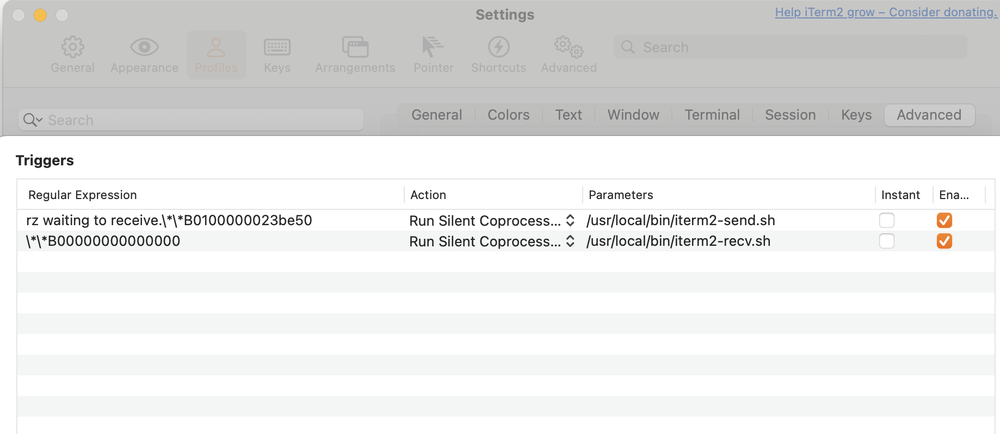
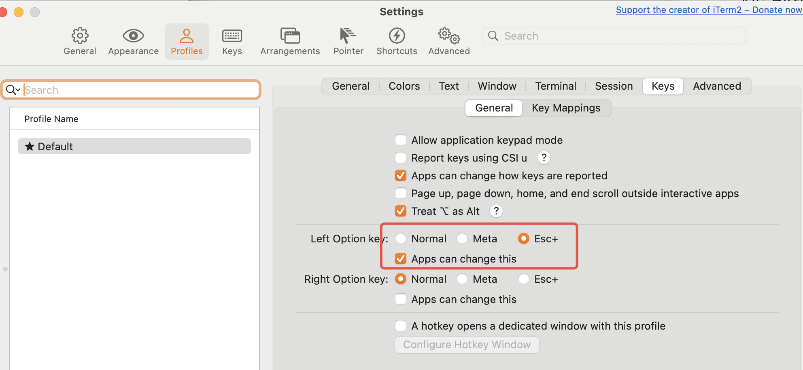
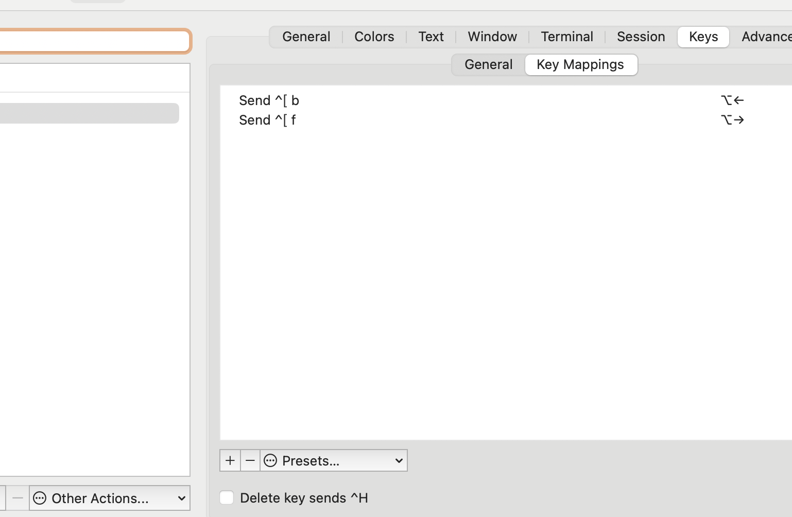

## 服务器上传下载文件
```
brew install --cask iterm2
brew install lrzsz
# 把下面的两个脚本iterm2-send-zmodem.sh，iterm2-recv-zmodem.sh放到/usr/local/bin目录
profiles -> edit profile -> advanced -> Triggers edit
# 执行rz sz 查看输出，\转义，填入到tiggers中
```

> 服务器上传下载脚本copy from https://github.com/aikuyun/iterm2-zmodem.git
```shell
#!/bin/bash
# 这个脚本来自 github，删掉了一些 ** 言论。
# iterm2-send-zmodem.sh

osascript -e 'tell application "iTerm2" to version' > /dev/null 2>&1 && NAME=iTerm2 || NAME=iTerm
if [[ $NAME = "iTerm" ]]; then
	FILE=`osascript -e 'tell application "iTerm" to activate' -e 'tell application "iTerm" to set thefile to choose file with prompt "Choose a file to send"' -e "do shell script (\"echo \"&(quoted form of POSIX path of thefile as Unicode text)&\"\")"`
else
	FILE=`osascript -e 'tell application "iTerm2" to activate' -e 'tell application "iTerm2" to set thefile to choose file with prompt "Choose a file to send"' -e "do shell script (\"echo \"&(quoted form of POSIX path of thefile as Unicode text)&\"\")"`
fi
if [[ $FILE = "" ]]; then
	echo Cancelled.
	# Send ZModem cancel
	echo -e \\x18\\x18\\x18\\x18\\x18
	sleep 1
	echo
	echo \# Cancelled transfer
else
	/opt/homebrew/bin/sz "$FILE" --escape --binary --bufsize 4096
	sleep 1
	echo
	echo \# Received $FILE
fi

```
```shell
# iterm2-revc-zmodem.sh
#!/bin/bash
# 这个脚本来自 github，删掉了一些 ** 言论。

osascript -e 'tell application "iTerm2" to version' > /dev/null 2>&1 && NAME=iTerm2 || NAME=iTerm
if [[ $NAME = "iTerm" ]]; then
	FILE=$(osascript -e 'tell application "iTerm" to activate' -e 'tell application "iTerm" to set thefile to choose folder with prompt "Choose a folder to place received files in"' -e "do shell script (\"echo \"&(quoted form of POSIX path of thefile as Unicode text)&\"\")")
else
	FILE=$(osascript -e 'tell application "iTerm2" to activate' -e 'tell application "iTerm2" to set thefile to choose folder with prompt "Choose a folder to place received files in"' -e "do shell script (\"echo \"&(quoted form of POSIX path of thefile as Unicode text)&\"\")")
fi

if [[ $FILE = "" ]]; then
	echo Cancelled.
	# Send ZModem cancel
	echo -e \\x18\\x18\\x18\\x18\\x18
	sleep 1
	echo
	echo \# Cancelled transfer
else
	cd "$FILE"
	/opt/homebrew/bin/rz -E -e -b --bufsize 4096
	sleep 1
	echo
	echo
	echo \# Sent \-\> $FILE
fi

```
## 快捷键设置
1. 光标按照单词间隔移动
在 Profiles > Keys 中的 Left Option Key 和 Right Option Key 选项，选择 Esc+。这将使 Option 键作为 Meta 键，允许光标按单词跳跃。

分别修改option+←和option+→的映射如下图所示，选择Action为“Send Escape Sequence”，然后输入“b”和“f”即可


## zsh 配置
```shell
# ~/.mine_zsh > ~/.zshrc
VSCODE_PATH="/Applications/Visual Studio Code.app/Contents/Resources/app/bin"
export PATH="$PATH:$VSCODE_PATH"
```